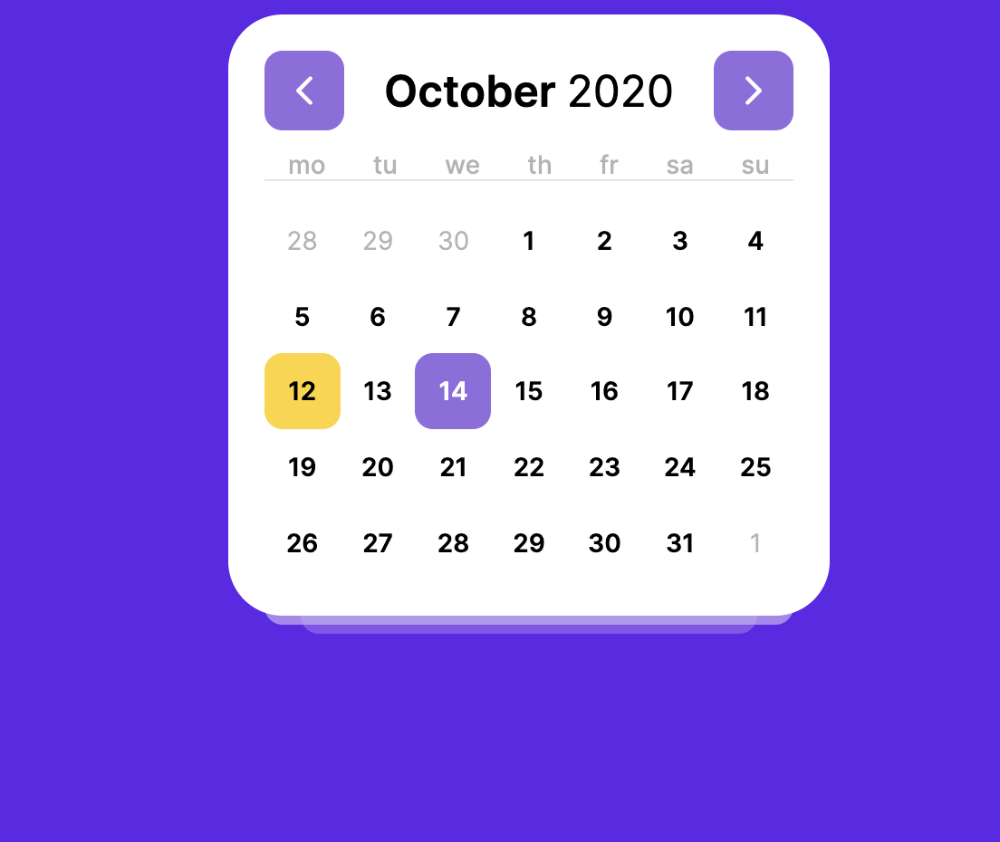

## React based calendar experiment

I've tried to find some nice looking calendar on dribbble and implement it using react.

I've used:

- styled-components
- parcel for bundling
- date-fns for date operations

[Demo](https://witkod.github.io/ui-experiments-calendar/)
